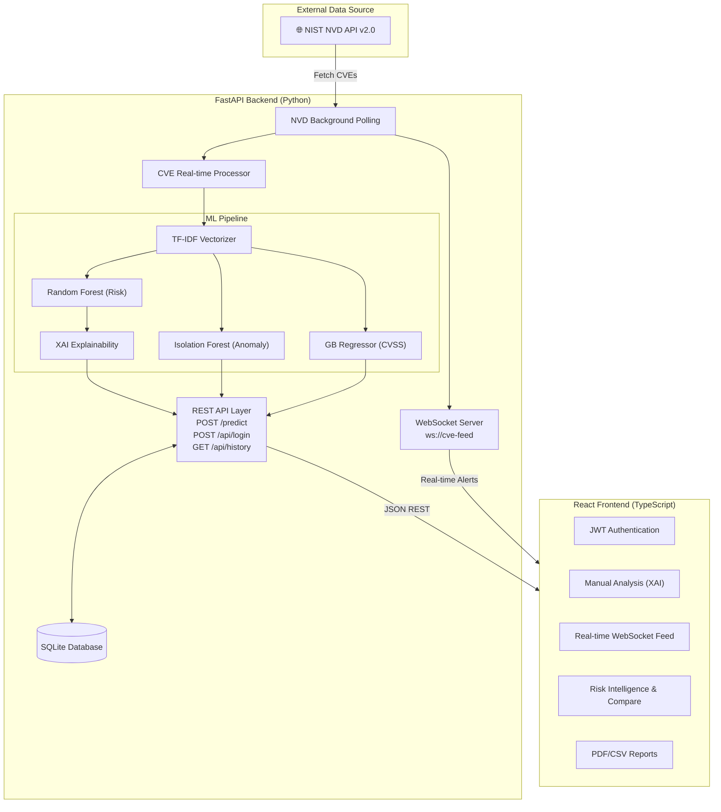

<p align="center">
  
</p>

<h1 align="center">CVE Real-time Risk Prediction System</h1>

<p align="center">
  <strong>Machine Learning-powered Vulnerability Intelligence Platform</strong>
</p>

<p align="center">
  <a href="https://opensource.org/licenses/MIT"></a>
  <a href="https://www.python.org/downloads/"></a>
  <a href="https://fastapi.tiangolo.com/"></a>
  <a href="https://reactjs.org/"></a>
  <a href="https://scikit-learn.org/"></a>
  
</p>

<p align="center">
  An end-to-end cybersecurity platform that ingests, analyzes, and classifies vulnerabilities from the <a href="https://nvd.nist.gov/">National Vulnerability Database</a> in real-time using ensemble machine learning models, anomaly detection, and a modern React dashboard.
</p>

---

## Table of Contents

- [Overview](#overview)
- [Key Features](#key-features)
- [System Architecture](#system-architecture)
- [Tech Stack](#tech-stack)
- [Getting Started](#getting-started)
- [API Reference](#api-reference)
- [ML Methodology](#ml-methodology)
- [Project Structure](#project-structure)
- [Testing](#testing)
- [Performance](#performance)
- [Security & Disclaimer](#security--disclaimer)
- [Contributing](#contributing)
- [License](#license)

---

## Overview

CyberSpec is an intelligent vulnerability triage system built as a full-stack application. It automatically fetches CVE (Common Vulnerabilities and Exposures) data from the NIST NVD API, processes vulnerability descriptions through a multi-model ML pipeline, and presents actionable risk intelligence through a modern dashboard.

The system combines **supervised classification** (Random Forest) with **unsupervised anomaly detection** (Isolation Forest) to provide a dual-layer analysis — predicting risk severity while simultaneously flagging statistically unusual vulnerability patterns that may warrant further investigation.

---

## Key Features

| Feature | Description |
|---------|-------------|
| **Real-time CVE Ingestion & WebSockets** | Automated fetching from NVD API, pushed directly to clients via WebSockets with real-time UI notifications |
| **Three-Level Risk Classification** | ML-based prediction classifying CVEs as `HIGH`, `MEDIUM`, or `LOW` risk with confidence scores |
| **CVSS Score Regression** | Dedicated ML model predicting the precise CVSS v3.x score from just the vulnerability description |
| **Explainable AI (XAI)** | Transparent predictions displaying exact keyword boosts and top TF-IDF features driving the risk assessment |
| **Anomaly Detection** | Isolation Forest model identifies vulnerability descriptions that deviate from historical patterns |
| **Persistent Historical Database** | All predictions are logged to a SQLite database tied to secure user accounts (JWT Authentication) |
| **Report Generation** | Export comprehensive vulnerability assessments to professional PDF or CSV formats |
| **Interactive Dashboard** | React + TypeScript SPA with real-time data visualization, comparative analysis, and risk intelligence views |
| **Graceful Degradation** | Automatic fallback to local CSV dataset when NVD API is unavailable |

---

## System Architecture



---

## Tech Stack

### Backend

| Component | Technology | Purpose |
|-----------|-----------|---------|
| Web Framework | [FastAPI](https://fastapi.tiangolo.com/) | Async REST API with auto-generated OpenAPI docs |
| ML Framework | [scikit-learn](https://scikit-learn.org/) | Random Forest classifier + Isolation Forest |
| Text Processing | TF-IDF (scikit-learn) | Vulnerability description vectorization |
| Data Processing | [Pandas](https://pandas.pydata.org/), [NumPy](https://numpy.org/) | Dataset manipulation and numerical ops |
| Model Persistence | [Joblib](https://joblib.readthedocs.io/) | Serialization of trained ML models |
| HTTP Client | [Requests](https://docs.python-requests.org/) | NVD API communication |
| Validation | [Pydantic](https://docs.pydantic.dev/) | Request/response schema validation |
| Server | [Uvicorn](https://www.uvicorn.org/) | ASGI server with hot reload |

### Frontend

| Component | Technology | Purpose |
|-----------|-----------|---------|
| Framework | [React 18](https://react.dev/) | Component-based UI |
| Language | [TypeScript](https://www.typescriptlang.org/) | Type-safe development |
| Build Tool | [Vite 5](https://vitejs.dev/) | Fast HMR and optimized builds |
| UI Components | [shadcn/ui](https://ui.shadcn.com/) + [Radix UI](https://www.radix-ui.com/) | Accessible, customizable components |
| Styling | [Tailwind CSS 3](https://tailwindcss.com/) | Utility-first CSS |
| Data Fetching | [TanStack Query](https://tanstack.com/query) + [Axios](https://axios-http.com/) | Server state management |
| Charts | [Recharts](https://recharts.org/) | Data visualization |
| Animations | [Framer Motion](https://www.framer.com/motion/) | Micro-interactions and transitions |
| Routing | [React Router 6](https://reactrouter.com/) | Client-side navigation |

---

## Getting Started

### Prerequisites

- **Python** 3.9 or higher
- **Node.js** 18+ and **npm**
- **NVD API Key** _(optional, recommended)_ — [Request one here](https://nvd.nist.gov/developers/request-an-api-key)

### 1. Clone the Repository

```bash
git clone https://github.com/<your-username>/ML-Cybersec.git
cd ML-Cybersec
```

### 2. Backend Setup

```bash
cd backend

# Create and activate a virtual environment (recommended)
python -m venv venv
# Windows (PowerShell)
.\venv\Scripts\Activate.ps1
# Linux/macOS
source venv/bin/activate

# Install dependencies
pip install -r requirements.txt
```

### 3. Train ML Models

> Models are not included in the repository (`.pkl` files are gitignored). You must train them before starting the backend.

```bash
# Train the Random Forest classifier + TF-IDF vectorizer
python train_model.py

# Train the Isolation Forest anomaly detector
python train_anomaly.py
```

This generates three model files:
| File | Model | Size |
|------|-------|------|
| `rf_model.pkl` | Random Forest Classifier | ~3.2 MB |
| `tfidf_vectorizer.pkl` | TF-IDF Vectorizer | ~86 KB |
| `anomaly_model.pkl` | Isolation Forest | ~770 KB |

### 4. Configure Environment (Optional)

Create a `.env` file in the `backend/` directory:

```env
NVD_API_KEY=your-api-key-here
```

> **Without an API key**, the NVD API rate-limits you to **5 requests / 30 seconds**.
> **With an API key**, you get **50 requests / 30 seconds**.

### 5. Start the Backend

```bash
uvicorn app:app --reload --port 8000
```

The API will be available at:
- **API Root**: http://127.0.0.1:8000
- **Swagger UI**: http://127.0.0.1:8000/docs
- **ReDoc**: http://127.0.0.1:8000/redoc

### 6. Frontend Setup

```bash
cd ../frontend

# Install dependencies
npm install

# Start development server
npm run dev
```

The dashboard will be available at **http://localhost:5173**.

---

## API Reference

### `POST /predict`

Predict risk level for a single CVE description.

**Request:**
```json
{
  "description": "A remote code execution vulnerability exists in the web application framework that allows an attacker to execute arbitrary code via crafted requests."
}
```

**Response:**
```json
{
  "risk": "HIGH",
  "confidence": 0.87,
  "anomalous": false,
  "anomaly_score": 0.15
}
```

### `GET /predict/latest-cves`

Fetch and analyze recent CVEs from the NVD.

| Parameter | Type | Default | Description |
|-----------|------|---------|-------------|
| `days_back` | int | 3 | Number of days to look back (1–30) |
| `max_results` | int | 10 | Maximum CVEs to fetch (1–100) |

### `GET /api/nvd/daily`

Fetch CVEs published today (UTC) with automatic fallback.

| Parameter | Type | Default | Description |
|-----------|------|---------|-------------|
| `fallback_days` | int | 3 | Fallback window if no CVEs today (2–3) |

**Response:**
```json
{
  "mode": "daily",
  "window": {
    "pubStartDate": "2026-07-11T00:00:00.000Z",
    "pubEndDate": "2026-07-11T17:30:00.000Z"
  },
  "count": 5,
  "items": [
    {
      "cve_id": "CVE-2026-12345",
      "published": "2026-07-11T10:30:00.000Z",
      "risk": "HIGH",
      "confidence": 0.87,
      "anomalous": false
    }
  ]
}
```

### `GET /health`

Health check endpoint for monitoring.

### `GET /meta`

Returns model metadata, risk level definitions, and probability thresholds.

> 📖 Full interactive documentation is available at `/docs` (Swagger UI) when the backend is running.

---

## ML Methodology

### Risk Classification Pipeline

```
CVE Description (text)
    │
    ▼
┌─────────────────────┐
│   TF-IDF Vectorizer │  1000 features, English stop words removed
│   (pre-trained)     │  Uses transform() only — no retraining
└─────────┬───────────┘
          │
    ┌─────┴─────┐
    ▼           ▼
┌────────┐  ┌────────────────┐
│ Random │  │ Isolation      │
│ Forest │  │ Forest         │
│ (100   │  │ (100 trees,    │
│ trees) │  │ 5% contam.)    │
└───┬────┘  └───────┬────────┘
    │               │
    ▼               ▼
┌────────────┐  ┌──────────────┐
│ Probability│  │ Anomaly      │
│ Score      │  │ Score + Flag │
└───┬────────┘  └──────────────┘
    │
    ▼
┌─────────────────────────┐
│ Keyword Severity Booster│  Context-aware adjustments
│ (auth, attack vectors)  │  based on security domain
└───┬─────────────────────┘
    │
    ▼
┌─────────────────────┐
│ Three-Level Mapping │
│ HIGH   ≥ 0.70       │
│ MEDIUM 0.35 – 0.69  │
│ LOW    < 0.35       │
└─────────────────────┘
```

### Training Data

- **Source**: Historical CVE records with CVSS scores from `cve_data.csv`
- **Labels**: Binary — `1` (HIGH) if CVSS ≥ 7.0, `0` (LOW) otherwise
- **Features**: TF-IDF vectors (top 1000 terms, English stop words removed)
- **Split**: 80% train / 20% test, stratified, `random_state=42`

### Keyword Severity Boosting

The raw binary classifier output is enhanced with domain-specific keyword analysis:

| Category | Keywords (examples) | Boost |
|----------|-------------------|-------|
| **Critical** (unauthenticated) | RCE, arbitrary code execution, root access | +0.40 |
| **Dangerous** (unauthenticated) | SQL injection, command injection | +0.35 |
| **MEDIUM** (strong evidence) | XSS, CSRF, path traversal, privilege escalation | +0.18 to +0.25 |
| **LOW** indicators | debug info, cosmetic, minimal impact | −0.08 to −0.15 |

Authentication context (authenticated vs. unauthenticated) is factored into the boosting logic to prevent over-classification.

---

## Project Structure

```
ML-Cybersec/
├── backend/
│   ├── app.py                     # FastAPI application entry point
│   ├── cve_realtime_processor.py  # Core ML prediction & NVD ingestion engine
│   ├── nvd_daily_service.py       # Daily CVE fetching with fallback logic
│   ├── env_setup.py               # Environment configuration helper
│   ├── train_model.py             # Random Forest + TF-IDF training script
│   ├── train_anomaly.py           # Isolation Forest training script
│   ├── cve_data.csv               # Training dataset (historical CVEs)
│   ├── requirements.txt           # Python dependencies
│   ├── .env                       # API keys (gitignored)
│   ├── START_HERE.md              # Backend-specific documentation
│   ├── demo_realtime_cve.py       # Interactive demo script
│   ├── quickstart.py              # Quick-start validation script
│   ├── production_integration.py  # Production usage examples
│   ├── static/                    # Static web assets
│   ├── templates/                 # HTML templates
│   └── test_*.py                  # Test suite (6 test files)
│
├── frontend/
│   ├── src/
│   │   ├── pages/
│   │   │   ├── Landing.tsx           # Hero landing page
│   │   │   ├── ManualAnalysis.tsx     # Single CVE analysis form
│   │   │   ├── RealTimeCVE.tsx        # Live NVD CVE monitor
│   │   │   └── RiskIntelligence.tsx   # Aggregate risk dashboard
│   │   ├── components/               # Reusable UI components
│   │   │   ├── Navbar.tsx             # Navigation bar
│   │   │   ├── CVETable.tsx           # CVE results table
│   │   │   ├── RiskBadge.tsx          # Risk level badge
│   │   │   ├── ConfidenceBar.tsx      # Confidence score bar
│   │   │   ├── AnomalyIndicator.tsx   # Anomaly detection indicator
│   │   │   └── ui/                    # shadcn/ui primitives
│   │   ├── services/                  # API client layer
│   │   ├── context/                   # React context providers
│   │   └── hooks/                     # Custom React hooks
│   ├── package.json
│   ├── vite.config.ts
│   ├── tailwind.config.ts
│   └── tsconfig.json
│
├── .gitignore
└── README.md                      # ← You are here
```

---

## Testing

The backend includes a comprehensive test suite:

```bash
cd backend

# Run all tests
python -m pytest test_*.py -v

# Run specific test files
python -m pytest test_fastapi.py -v       # API endpoint tests
python -m pytest test_predict.py -v       # Prediction logic tests
python -m pytest test_endpoints.py -v     # Integration tests
python -m pytest test_simple.py -v        # Smoke tests
python -m pytest test_three_level_classification.py -v  # Classification tests
python -m pytest test_json_fix.py -v      # JSON serialization tests
```

---

## Performance

| Metric | Value |
|--------|-------|
| **Prediction Latency** | ~0.5–1s per CVE |
| **Memory Footprint** | ~100 MB (models in memory) |
| **Model Accuracy** | ~81% (Random Forest on test set) |
| **API Rate Limit (no key)** | 5 requests / 30 seconds |
| **API Rate Limit (with key)** | 50 requests / 30 seconds |
| **Recommended Batch Size** | 10–50 CVEs per request |

---

## Security & Disclaimer

> [!WARNING]
> **This system is an academic/research tool.** It is designed for educational purposes and vulnerability triage assistance.

### What this system DOES

- ✅ Predict CVE risk levels based on historical description patterns
- ✅ Flag statistically anomalous vulnerability descriptions
- ✅ Provide structured, queryable risk intelligence from NVD data
- ✅ Assist security teams with initial triage and prioritization

### What this system DOES NOT do

- ❌ Detect zero-day vulnerabilities or undisclosed exploits
- ❌ Replace professional security assessments or penetration testing
- ❌ Provide real-time threat intelligence or IOC feeds
- ❌ Guarantee accuracy — always validate with CVSS scores and vendor advisories

---

## Contributing

Contributions are welcome! Please follow these steps:

1. Fork the repository
2. Create a feature branch (`git checkout -b feature/your-feature`)
3. Commit your changes (`git commit -m 'Add your feature'`)
4. Push to the branch (`git push origin feature/your-feature`)
5. Open a Pull Request

### Development Guidelines

- Follow PEP 8 for Python code
- Use TypeScript strict mode for frontend code
- Add tests for new backend functionality
- Update documentation for API changes

---

## License

This project is licensed under the **MIT License** — see the [LICENSE](LICENSE) file for details.

---

<p align="center">
  <strong>Built for Cybersecurity Research</strong>
  <br />
  <sub>CyberSpec — ML-Cybersec</sub>
</p>
