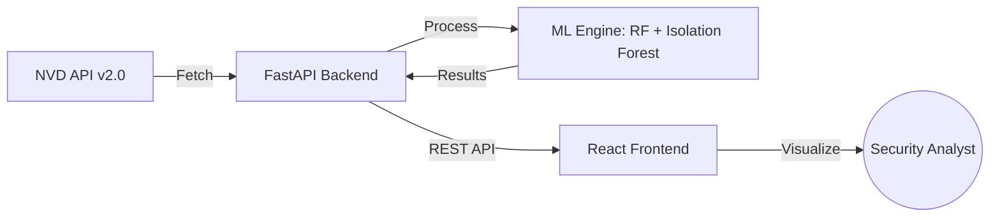

# 🛡️ CVE Real-time Risk Prediction System

[](https://opensource.org/licenses/MIT)
[](https://www.python.org/downloads/)
[](https://reactjs.org/)
[](https://fastapi.tiangolo.com/)

An advanced, machine-learning-powered cybersecurity tool designed to ingest, analyze, and predict the risk levels of Common Vulnerabilities and Exposures (CVEs) in real-time.

---

## ✨ Key Features

- **🌐 Real-time CVE Ingestion**: Automatically fetches recent vulnerabilities from the **NVD (National Vulnerability Database) REST API 2.0**.
- **🧠 ML-Based Risk Prediction**: Uses a **Random Forest Classifier** trained on historical CVE data to predict if a vulnerability is `HIGH`, `MEDIUM`, or `LOW` risk based on its description.
- **🔍 Anomaly Detection**: Employs an **Isolation Forest** model to detect statistically unusual vulnerability patterns that may indicate emerging threats.
- **📊 Modern Dashboard**: A high-performance frontend built with **React**, **Vite**, and **shadcn/ui** for clear visualization and analysis.
- **⚡ High-Performance API**: A robust **FastAPI** backend designed for speed, scalability, and easy integration.

---

## 🛠️ Tech Stack

### Backend
- **Framework**: FastAPI (Python)
- **Machine Learning**: Scikit-learn (Random Forest, Isolation Forest, TF-IDF)
- **Data Engineering**: Pandas, NumPy
- **External Integration**: NIST NVD API v2.0
- **Documentation**: Swagger UI & ReDoc (automatic)

### Frontend
- **Framework**: React 18 with Vite
- **Styling**: Tailwind CSS & shadcn/ui
- **Language**: TypeScript
- **State Management**: React Hooks & Context API

---

## 📐 Architecture



---

## 🚀 Quick Start

### Prerequisites
- Python 3.9+
- Node.js & npm (v18+)
- NVD API Key (Optional, get it [here](https://nvd.nist.gov/developers/request-an-api-key))

### 1. Setup Backend
```bash
cd backend
python -m venv venv
# Windows: venv\Scripts\activate | Linux/Mac: source venv/bin/activate
pip install -r requirements.txt
# (Optional) Set your API Key
# $env:NVD_API_KEY="your-key"
uvicorn app:app --reload --port 8000
```
*Backend runs at `http://127.0.0.1:8000`. Explore docs at `/docs`.*

### 2. Setup Frontend
```bash
cd frontend
npm install
npm run dev
```
*Frontend runs at `http://localhost:5173`.*

---

## 📖 Detailed Guides

- **[Backend Setup & ML Details](backend/START_HERE.md)**: Deep dive into the ML architecture and backend configuration.
- **[NVD Integration Guide](backend/REALTIME_FEATURES_README.md)**: Details on the real-time fetching logic.
- **[Architecture Deep Dive](backend/ARCHITECTURE.md)**: Technical design details.

---

## 🛡️ Important Safety & Disclaimer

> [!WARNING]
> This system is an **academic/research tool**. Anomaly detection identifies statistical deviations from historical norms, **not zero-day exploits**. This tool should assist, not replace, professional security assessments.

---

## 📄 License

This project is licensed under the MIT License - see the [LICENSE](LICENSE) file for details.

---

**Built with ❤️ for CyberSecurity Research.**
